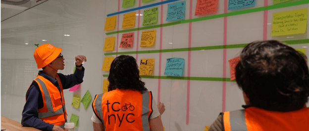

<h1 style="color: #FF6600;">Joining us for Camp today? View <a href="https://docs.google.com/spreadsheets/d/e/2PACX-1vQg5KkuMoSj9VTWiKSSD2sfScbjQge2G_I_492TImKPmEXte7dEy1EwRjR_4sqHdu7ahMdV6NKOVHrb/pubhtml?gid=302942185&single=true">the board</a> online!</h1>

### TransportationCamp NYC 2025 is returning to Brooklyn!

TransportationCamp NYC will be held on Saturday, October 25th at NYU&#39;s Tandon School of Engineering in Downtown
Brooklyn. Join us to discuss all things transportation and connect with professionals, students, and enthusiasts alike!

TransportationCamp is an [unconference](https://en.wikipedia.org/wiki/Unconference) - every session is planned,
proposed, and led by attendees like you. It&#39;s the perfect opportunity to share your transportation passion with a
diverse gathering of individuals from our multidisciplinary industry.

TransportationCamp welcomes all attendees, whether you&#39;re a planner,
software developer, engineer, student, transportation professional, community member, policymaker, or just excited
about mobility!

[Register here](https://tcnyc.ticketspice.com/transportationcamp-nyc-2025) to join us for a fun day of transportation
learning and networking on October 25th!

### Event schedule

* **9:30 AM:** Doors open; check-in and breakfast
* **10:30 AM:** Welcome and kick-off
* **11:30 AM:** Session 1
* **12:30 PM:** Lunch and networking
* **1:30 PM:** Session 2
* **2:45 PM:** Session 3
* **4:00 PM:** Networking breakouts and fun stuff
* **5:00 PM:** Post-camp hangout: Pizza, Dessert, and Social Time!

### Presenting?

Thinking about presenting at a session? Sessions may come in a variety of formats: informal discussions,
birds-of-a-feather, lightning talks, presentations, open space technology, and others. We welcome experts, but really
you just need to care about transportation issues or be nerds about it like us. The important thing is that you bring
your ideas and enthusiasm, and engage! All the breakout rooms are equipped with a projector or whiteboard. We will
be handing out session idea cards throughout registration. If you have an idea for a session, feel free to write it
down in advance and bring it with you to the event.

### Student scholarship

[Applications](https://forms.gle/A4BkuyNXorecNEmM8) are now open for our scholarship essay! Make sure you submit your
essay by Sunday, October 19 at 11:59pm EDT to enter for a chance to win $500!

### First time at a TransportationCamp?

- How To TransportationCamp: Review
  the [TransportationCamp 101 guide](http://transportationcamp.org/2011/02/how-transportationcamp-works-the-essential-guide/)
  that explains all aspects of the event.
- Participation Encouraged: Sessions are formed as the day goes on, so be sure to come with topics for discussion.
  If you have an idea, feel free to share and add your thoughts.
- Rule of Two Feet: Never hesitate to leave a session if you suddenly find it&#39;s not for you, or if there&#39;s
  another session that you want to check out, too!

### Social media

Make sure you&#39;re up to date by following us on [LinkedIn](https://www.linkedin.com/company/tcnyc/posts)
and by subscribing to our [email updates](http://eepurl.com/dFtMzX). And keep the conversation going! Tag your
tweets, Instagram photos, and more with the official event hashtag: **#TCNYC25**
