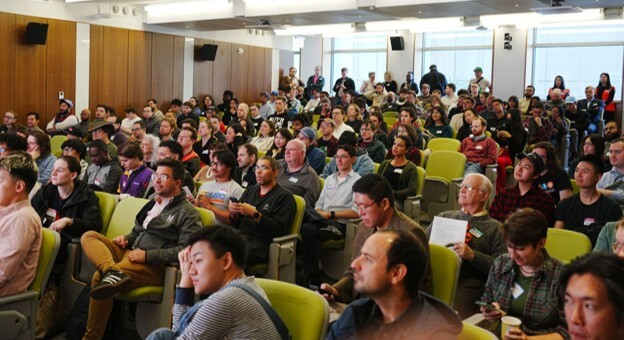

### Join us on Saturday, October 24, for TransportationCamp NYC 2026!

## [Register today!](https://tcnyc.ticketspice.com/transportationcamp-nyc-2026)

TransportationCamp NYC will be held on Saturday, October 24 at NYU&#39;s Tandon School of Engineering in Downtown
Brooklyn. Join us to discuss all things transportation and connect with professionals, students, and enthusiasts alike!

TransportationCamp is an [unconference](https://en.wikipedia.org/wiki/Unconference) - every session is planned,
proposed, and led by attendees like you. It&#39;s the perfect opportunity to share your transportation passion with a
diverse gathering of individuals from our multidisciplinary industry.

TransportationCamp welcomes all attendees, whether you&#39;re a planner, software developer, engineer, student,
transportation professional, community member, policymaker, or just excited about mobility!

[Register here](https://tcnyc.ticketspice.com/transportationcamp-nyc-2026) to join us for a fun day of transportation
learning and networking on October 24!

### Interested in sponsoring?

We are seeking sponsorship from engineering firms, research centers, planning organizations, and more to make TCNYC26
extra special! To learn about sponsorship packages, contact [TCampNYC@gmail.com](mailto:TCampNYC@gmail.com). Put your
organization&#39;s name in front of the people who are working on the latest and greatest at the intersection of
transportation and technology.

### Student Scholarship

[Applications](https://forms.gle/fZH4vs2v52Rhtzcn7) are now open for our student scholarship! TransportationCamp NYC
will award one $500 scholarship this year thanks to the support of VHB! All undergraduate students, as well as full-time
master&#39;s degree students, are eligible to apply. The deadline for scholarship applications is Sunday, October 18, at
11:59pm ET!

### Presenting?

Thinking about presenting at a session? Sessions may come in a variety of formats: informal discussions,
birds-of-a-feather, lightning talks, presentations, and others. We welcome experts, but really you just need to care
about transportation issues or be nerds about it like us. The important thing is that you bring your ideas and
enthusiasm, and engage! All the breakout rooms are equipped with a projector or whiteboard. We will be handing out
session idea cards throughout registration. If you have an idea for a session, feel free to write it down in advance and
bring it with you to the event.

### First time at a TransportationCamp?

- How To TransportationCamp: Review
  the [TransportationCamp 101 guide](http://transportationcamp.org/2011/02/how-transportationcamp-works-the-essential-guide/)
  that explains all aspects of the event.
- Participation Encouraged: Sessions are formed as the day goes on, so be sure to come with topics for discussion. If
  you have an idea, feel free to share and add your thoughts.
- Rule of Two Feet: Never hesitate to leave a session if you suddenly find it&#39;s not for you, or if there&#39;s
  another session that you want to check out, too!

### Social media

Make sure you&#39;re up to date by following us on [LinkedIn](https://www.linkedin.com/company/tcnyc/posts) and by
subscribing to our [email updates](http://eepurl.com/dFtMzX). And keep the conversation going! Tag your tweets,
Instagram photos, and more with the official event hashtag: **#TCNYC26**
